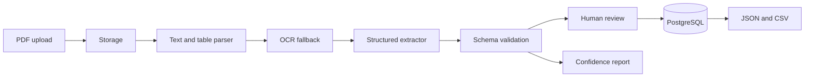

# DocuStruct AI

A document-processing platform for converting PDFs into validated, reviewable structured data with traceable extraction results.

> **Status:** Active development. Source code and verified capabilities will be published after the local build is completed.

## Project goals

- Safe PDF upload and storage abstraction
- Native text and table extraction with OCR fallback
- Provider-based structured extraction
- JSON Schema validation and field-level confidence
- Human-review queues
- PostgreSQL persistence
- JSON and CSV exports
- Batch processing and explicit failure handling

Only synthetic demonstration documents will be included. The repository will not contain real resumes, invoices, medical records, or personal information.

## Planned architecture

## Publication plan

The completed repository is expected to include migrations, extraction-quality fixtures, tests, Docker Compose, CI, safe configuration, API documentation, demo documents, architecture documentation, and a verification evidence table. Source will be pushed after the extraction pipeline passes its checks.
