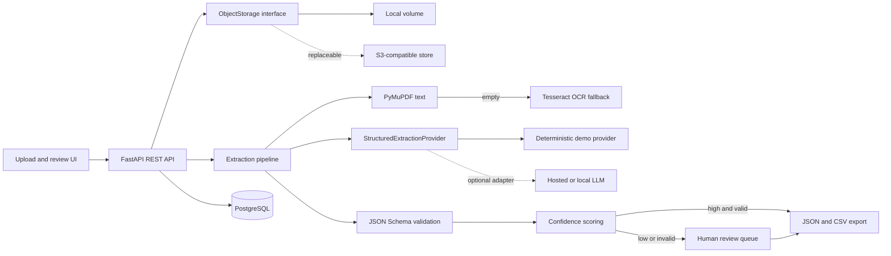

# Architecture

The application is a modular monolith. The HTTP, persistence, extraction, and storage boundaries are explicit, but one deployable keeps the portfolio demo operationally small. SQLite is supported only as a zero-dependency local fallback; Docker Compose uses PostgreSQL.

## Processing lifecycle

`queued → processing → completed | review_required | failed`

- Upload checks file type and bounded size before storage.
- The source PDF is addressed by a generated key and recorded with SHA-256.
- Embedded PDF text is preferred. OCR runs only when no embedded text is present.
- A provider maps text to schema-shaped data. The included deterministic provider makes tests reproducible; an LLM adapter can implement the same interface.
- JSON Schema errors and required-field confidence determine whether human review is mandatory.
- Review corrections are schema-validated and retained separately from machine output for auditability.

## Production evolution

For sustained production load, move processing to a durable queue, use an S3-compatible object store, add tenant-aware authorization, encrypt sensitive fields, apply malware scanning, add request idempotency, and instrument traces/metrics. These are documented gaps, not current capabilities.

